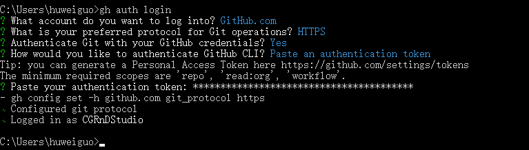

==============================
Git安装配置本机身份验证
==============================

从几何时起Github单方面取消了Git终端使用账号密码访问，从而导致无法提交代码

此时需要安装配置个人身份令牌

https://docs.github.com/en/get-started/quickstart/set-up-git#next-steps-authenticating-with-github-from-git

下载gh的msi客户端安装

https://github.com/cli/cli/releases/tag/v2.4.0

安装完成管理员打开命令提示符，确保git.exe在Path环境变量里

输入gh auth login，然后依次选择下图中选项

在选择Paste an authentication token之后，首先你需要网页端登陆www.github.com

找settings>Developer settings>Personal access tokens>Generate new token，勾选所有选项创建即可

参考文档

https://docs.github.com/en/authentication/keeping-your-account-and-data-secure/creating-a-personal-access-token
