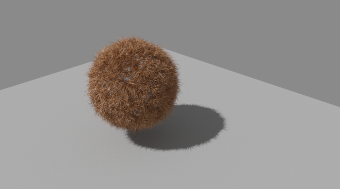

================================
Maya Redshift渲染Xgen毛发流程
================================

- 创建个球和地面，选择球Import Preset From Library，选择Bear预设

- 创建Redshift Physical Light，修改Light Type>Directional，Intensity Multiplier>1

- 创建Redshift Dome Light，降低Tint

- 创建RedshiftHair材质，选择description给上材质

- 修改Xgen面板Renderer为Redshift

- 修改Render Settings>GI>Brute Force，采样32-128

效果图：

